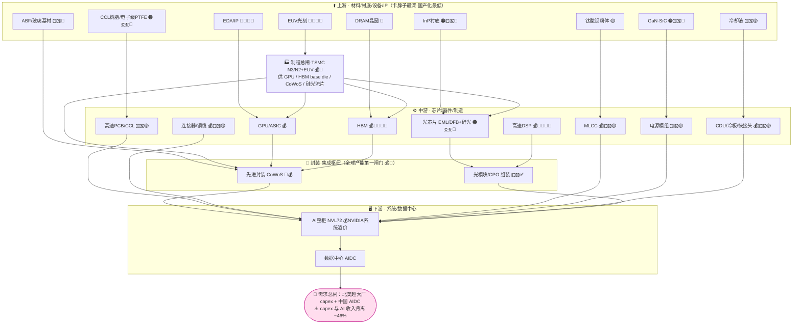

# 07 AI 硬件全产业链路线图（上中下游关系总图）

> **本图定位**：综合 [05-技术架构测绘](./05-AI硬件产业链全景测绘.md) 与 [06-投资兑现度](./06-AI硬件产业链投资兑现度.md) 两轮研究，画一张**直观反映上游→中游→封装→下游各环节关系**的全产业链路线图。一张图看清：谁喂谁、谁卡谁、价值沉淀在哪一层、国产替代卡在哪一层。
>
> **零代码、非投资建议**：只标环节与企业类别、不含证券代码、不构成买卖建议。
>
> **图例标记**：
> 🔴 极高卡点 ｜ 🟠 高卡点 ｜ 🟡 中卡点 　｜　💰 价值/利润集中 　｜　🇨🇳✅ 国产已放量 ｜ 🇨🇳🟡 认证导入 ｜ 🇨🇳🔴 卡脖子(送样/受限)

---

## 一、数据通路骨架（横看：电 → 光，短 → 长）

整条链的物理主轴——一颗 GPU 的数据如何被"喂养"并搬运出去，每一跳对应一道工程墙：

```
 GPU/ASIC ──①喂数──> HBM ──②集成──> 先进封装 ──③出芯片──> 高速PCB/铜缆 ──④变光──> 光模块/CPO ──> 光网络
 (算力硅)   内存墙   (存储)  集成墙   (CoWoS枢纽)  电域最后一公里  (scale-up铜)  距离墙   (scale-out)
   ▲                                                                                      
   └─ 越往 1.6T/CPO/Rubin 走，"光"越下沉、越贴近算力硅，铜的边界不断内推（守铜至 ~2028）
```

## 二、上中下游关系总图（纵看：供给自上而下流向系统）

```
══════════════════════════════════════════════════════════════════════════════════════
 ⬆️ 上游 · 材料 / 衬底 / 设备 / IP        ← 卡脖子最深、国产化最低、价值随稀缺暴涨
──────────────────────────────────────────────────────────────────────────────────────
  InP衬底🟠🇨🇳🔴   钛酸钡粉体🟡   CCL树脂·电子级PTFE🟠🇨🇳🔴   GaN/SiC🟠🇨🇳🔴   ABF·玻璃基材🇨🇳🔴
  DRAM晶圆🔴   EUV光刻机🔴🇨🇳🔴(ASML独家)   EDA/IP🔴🇨🇳🔴   冷却液🇨🇳🟡(3M退PFAS)
     │喂光芯片      │喂MLCC          │喂PCB/CCL          │喂电源       │喂封装    │喂HBM
     ▼              ▼                ▼                  ▼            ▼         ▼
══════════════════════════════════════════════════════════════════════════════════════
 🏭 制程总闸 · TSMC 先进制程 N3/N2 + EUV　💰🔴　（全链物理总闸、高毛利）
     └──────────────> 供给：GPU裸片 ｜ HBM base die ｜ CoWoS ｜ 硅光流片 <──────────────
══════════════════════════════════════════════════════════════════════════════════════
 ⚙️ 中游 · 芯片 / 器件 / 制造
──────────────────────────────────────────────────────────────────────────────────────
  GPU/ASIC💰        HBM💰🔴🇨🇳🔴        光芯片EML/DFB+硅光🟠🇨🇳🔴    高速DSP💰🔴🇨🇳🔴
  连接器/铜缆💰🇨🇳🟡  MLCC💰🇨🇳🟡         高速PCB/CCL🇨🇳🟡(M9认证导入)  电源模组🇨🇳🟡  CDU/冷板/快接头💰🇨🇳🟡
     │GPU+HBM        │ABF/玻璃基              │EML+DSP                  │PDN去耦/供能/退热（贯穿）
     ▼               ▼                       ▼                         │
══════════════════════════════════════════════════════════════════════════════════════
 🧩 封装 · 集成枢纽　（全球产能第一闸门 💰🔴）
──────────────────────────────────────────────────────────────────────────────────────
  先进封装 CoWoS🔴💰(TSMC近独占)  ←把 GPU + 8×HBM 拼成一颗大芯片
  光模块/CPO 组装🇨🇳✅(全球第一·薄利)  ←把电信号转成光
     └────────────────────────┬──────────────────────────────┘
                              ▼ 集成上板/上柜
══════════════════════════════════════════════════════════════════════════════════════
 🖥️ 下游 · 系统 / 数据中心
──────────────────────────────────────────────────────────────────────────────────────
  AI 服务器 / 整柜 NVL72　──>　数据中心 AIDC　──>　云厂 / 超大厂 AI 服务
  💰 系统级溢价归 NVIDIA（整柜 + CUDA 生态，把价值从单芯片放大到整柜）
                              ▲
══════════════════════════════════════════════════════════════════════════════════════
 🔌 需求总闸（拉动全链的总开关·所有环节的共同风险源）
  北美超大厂 capex 2026E ~$6350–6900亿(+30~50%)  ＋  中国 AIDC 2026 新增 ~10GW
  ⚠️ capex 与 AI 实际收入背离约 46%（超 2001 电信泡沫 32%）——任一 hyperscaler 缩减沿链传导
══════════════════════════════════════════════════════════════════════════════════════

 ▌贯穿底座（不在信号链，但决定整柜能否开机/退热/稳压）：
   ⚡ 供电 48V→800V HVDC(0→1) + GaN/SiC　｜　❄️ 液冷 风冷→冷板(已标配)→浸没　｜　🪙 MLCC PDN去耦(遍布全板)
```

## 三、Mermaid 版（GitHub / 富渲染查看）



## 四、关系说明（怎么读这张图）

1. **三种"喂"的关系叠在一起**——别只看一条链：
   - **数据流（横向·电→光）**：GPU→HBM→封装→PCB/铜缆→光模块/CPO→光网络，决定算力能否被"喂饱"与搬出。
   - **供给流（纵向·上游→下游）**：材料/衬底/设备喂中游芯片，芯片在封装枢纽集成，再上柜进数据中心。
   - **拉动流（自下而上）**：下游 capex 是总开关，从系统倒着拉动每一个上游环节——**这也是全链共同的风险源**。

2. **价值沉淀在"两端 + 总闸"，中间组装薄利**（哑铃型）：💰 集中在 NVIDIA（下游系统溢价）、TSMC（制程+CoWoS 总闸）、SK 海力士（HBM）、博通/Marvell（DSP/ASIC IP）、上游卡点（EML/M9 CCL/MLCC/连接器/CDU）；光模块组装、OSAT、国产电源/铜缆/中低端 MLCC 走量薄利。

3. **卡脖子越往上游越深**（🔴 越靠上越密）：EUV/EDA/HBM/先进制程是硬断点；InP/电子级 PTFE/GaN-SiC/ABF 是材料级卡点；封装 CoWoS 是产能级总闸。**国产替代恰好相反——下游组装端（光模块🇨🇳✅）领跑，越往上游材料/设备/IP 越卡（🇨🇳🔴）**，这就是"哑铃型卡位"。

4. **正在重排关系的 5 个技术切换**（图中虚线级变量）：ASIC 分流 GPU ｜ CPO 渐替可插拔（scale-out 先光化，28–29 规模量产）｜ 铜退光进（scale-up 守铜至 ~2028）｜ 硅电容蚕食高端 MLCC ｜ HBM4 base die 升先进逻辑（TSMC"分肉"存储厂）。

## 五、看图三个洞见（连接两轮结论）

- **洞见一·瓶颈不在算力在"喂养"**：全链卡点集中在带宽（HBM）、集成（CoWoS）、互连（DSP/光芯片/连接器）、供电散热（800V/CDU）——而非 GPU 算力本身。投资与就业的确定性都在这些"喂养"环节。
- **洞见二·中国是哑铃型卡位**：组装端（光模块/PCB/液冷/铜缆）全球领跑且业绩真兑现，但 HBM/DSP/EUV/CUDA/高端材料仍硬卡；"出货份额 41% ≠ 供应链国产化率 ~17%"。国产替代真弹性在"向上游材料/芯片/设备上攻"，而非组装端。
- **洞见三·总闸是 capex、风险也是 capex**：全链景气由北美超大厂 capex 一根总绳牵动，当前主升中后段、capex 与 AI 变现背离扩大——这是悬在每一个环节头上的共同回调风险。

---

> 配套阅读：技术原理与逐环节卡片见 [05](./05-AI硬件产业链全景测绘.md)；景气/估值/国产替代兑现度与对抗核查见 [06](./06-AI硬件产业链投资兑现度.md)；专题情景推演见 [02-未来方向情景推演.md](./02-未来方向情景推演.md)。
