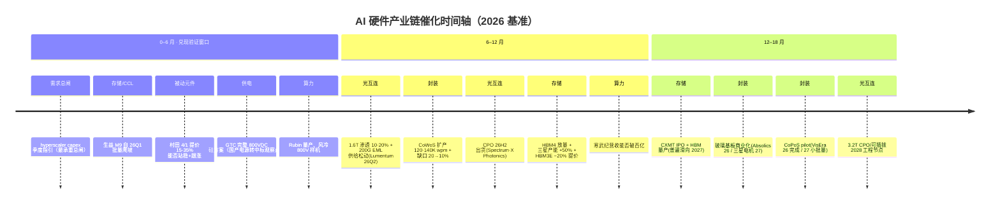

# 08 AI 硬件产业链景气时序图（时间维度·第二张图）

> **本图定位**：[07-全产业链路线图](./07-AI硬件全产业链路线图.md) 是**空间维度**（上中下游谁喂谁、谁卡谁）；本图是**时间维度**——把 [06-投资兑现度](./06-AI硬件产业链投资兑现度.md) 的「景气周期位置」与「催化时间轴」叠进一张图，横轴是时间（2025→2028+），看每个环节**当下处在景气曲线的哪一段、下一个兑现节点在何时**。
>
> **零代码、非投资建议**；时间点当目标看、非事实，随 capex 与技术切换节奏滑动。
>
> **景气相位图例**：🌱 0→1 萌芽/认证　📈 主升前段　🔥 主升中段　⚠️ 后段/见顶待验证

---

## 一、景气时序泳道图（横轴=时间，每格=相位 + 关键节点）

```
环节 ＼ 时间      2025             2026 H1            2026 H2            2027             2028–29+
──────────────────────────────────────────────────────────────────────────────────────────────
算力芯片          🔥主升           🔥Rubin量产        ⚠️增速台阶下滑      ⚠️Omdia判见顶      ASIC续分流GPU
HBM              🔥售罄           🔥HBM4放量(配Rubin) ⚠️DDR5反超(相对拐点) 缺货延续/国产滑此   HBM5🌱
先进封装 CoWoS    🔥满订           🔥扩产120-140K     🔥缺口20→10%(稀缺见顶) 售罄·瓶颈缓解      玻璃基板/CoPoS量产🌱
CPO              🌱认证年         🌱样机·Quantum-X   🌱Spectrum-X出货    小批(SemiAna下修)  🔥规模量产(28–29)
光模块 800G/1.6T  🔥800G(年降通道) 📈1.6T起量         📈1.6T放量(渗透10-20%) 1.6T主升          3.2T🌱
光芯片/磷化铟     📈100G EML放量   🌱200G验证/小批    🌱200G核心窗口(EML供给松) 📈200G放量?     —
MLCC 与被动元件   🌱Q4行情启动     🔥提价15-35%+囤货泡沫 🔥高端主升         高端延续27–28     硅电容🌱
高速铜连接/PCB/CCL 🔥主升(三龙头净利大增) 🔥M9配额·涨价20-40% 📈生益M9量产(Q3)   涨价周期         —
供电·液冷         📈液冷渗透14→33% 📈37%+/800V样机    🌱800V小批(Q3)     🔥800V/Rubin Ultra(Kyber) —
──────────────────────────────────────────────────────────────────────────────────────────────
催化锚点      │←──── 0–6 月 ────→│←───── 6–12 月 ─────→│←───── 12–18 月 ─────→│
  • capex 季度指引(最承重总闸)    • 1.6T 渗透 + 200G EML 供给松动   • CXMT IPO + HBM 量产(滑2027)
  • 生益 M9 26Q1 批量爬坡         • CoWoS 扩产 + 缺口 20→10%        • 玻璃基板商业化(Absolics26/三星电机27)
  • 村田 4/1 提价站稳 + 跟涨      • CPO 26H2 出货(Spectrum-X)       • CoPoS pilot(VisEra)
  • GTC 完整 800VDC 硅方案        • HBM4 放量 + 三星产能+50%        • 3.2T CPO/可插拔 2028 节点
  • Rubin 量产                   • 寒武纪营收能否破百亿
图例：🌱0→1萌芽/认证   📈主升前段   🔥主升中段   ⚠️后段/见顶待验证
```

## 二、Mermaid 催化时间轴（GitHub / 富渲染查看）



## 三、当下景气相位快照（2026 年中）

| 相位 | 环节 | 含义 |
|---|---|---|
| ⚠️ 后段/见顶待验证 | 算力芯片（NVIDIA GPU）、HBM（相对超额毛利） | 绝对景气仍在，但"最舒服的早段"已过；HBM 出现 DDR5 反超的相对拐点 |
| 🔥 主升中段 | 先进封装 CoWoS、MLCC 高端、PCB/CCL | 量价齐升、业绩真兑现，但稀缺性/涨价开始见顶或夹带囤货泡沫 |
| 📈 主升前段 | 1.6T 光模块、100G EML、液冷 | 渗透率快速爬坡、以量补价，久期相对更长 |
| 🌱 0→1 萌芽/认证 | CPO、200G EML、6 寸 InP、800V HVDC、玻璃基板、硅电容、国产 HBM | 靠预期/认证驱动、尚无真实放量收入；"送样/认证 ≠ 量产"，画饼风险最高 |

## 四、怎么用这张图（连接投资与就业判断）

1. **相位决定打法**：🔥/⚠️ 段（算力/HBM/CoWoS/MLCC/PCB）业绩已兑现、估值多已部分透支，看的是"涨价见顶信号 + capex 边际"；📈 段（1.6T/液冷/100G EML）久期更长、以量补价；🌱 段（CPO/200G EML/800V/玻璃基板/国产 HBM）是"期权"，**务必区分认证/送样与真实放量**——这正是 06 估值陷阱清单反复证伪的地方。
2. **催化锚点是验证表**：每个节点到期就回看"真兑现 vs 纯概念"——尤其 0–6 月的 capex 指引（总闸）、生益 M9 爬坡、村田提价站稳、GTC 800V 硅方案，是判断本轮景气能否延续的第一批硬信号。
3. **对劳动者**：🔥/📈 段（封装封测、液冷基础设施、高速 PCB/CCL、高容 MLCC 高端产线）是扩产最实、就业最确定的环节；🌱 段的扩产承诺与实际放量有 1–3 年时滞，岗位"画饼"风险高，**认准"已量产放量"层、避开"靠题材撑产能"层**。
4. **共同风险**：所有相位都挂在 capex 这根总绳上——横轴越往右，capex 与 AI 变现的背离（~46%）越是悬顶之剑，⚠️ 段最先承压。

---

> 配套：空间关系总图见 [07](./07-AI硬件全产业链路线图.md)；逐环节景气/估值/兑现度与对抗核查见 [06](./06-AI硬件产业链投资兑现度.md)；技术原理见 [05](./05-AI硬件产业链全景测绘.md)。
